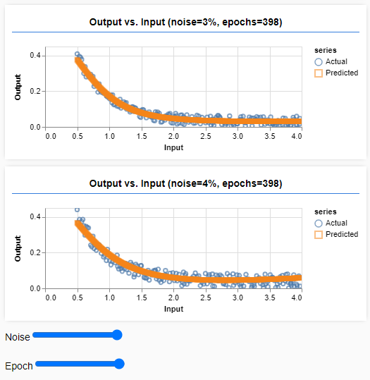

# Interactive data generation and fitting with TensorFlow.js

### Background
See the codelab [TensorFlow.js — Making Predictions from 2D Data](https://codelabs.developers.google.com/codelabs/tfjs-training-regression) for an introduction to TenosrFlow.js and also to the use-case and the code here.

### Features
- Interactive generation of (parameterized) test data
- Interactive training and validation of (parameterized) Neural Network
- Ease of extension of interactive parameters (sliders) thanks to a high level of abstraction and automation
- Encapulation, reusability, and separation of concerns with a purely class-based code
    - Immutable implementation of logic (but not data models) 

### Use-Case
- Samples of a decaying exponential function (with controllable sampling rate, noise, sparsity ...) are defined as ```x``` and ```y``` vectors.
- An Artificial Neural Network is trained to learn the dependency ```y=f(x)``` with controllable learning parameters.
- The plots ```x vs. y``` and ```x vs. f(x)``` are superimposed for a semi-quantitative assessment of the learning.

### Execution
Double-click on the file [index.html](./index.html) (or open it with your browser of choice). No server is needed.

### Snapshot of Control-Parameters and Outputs
  

### Defining new sliders
In the function ```Controller.createSliders```, simply extend the local variable ```sliders```. For example to include a slider for ```sparsity```, the definition can be extended as follows:
```
const sliders = {
  noisePercent: Controller.createSlider('Noise', 0, inputDataParameters.noisePercent * 2, sliderIndex++),
  epochs: Controller.createSlider('Epoch', 100, inputDataParameters.epochs * 2, sliderIndex++),
  sparsity: Controller.createSlider('Sparsity', 1, 6, sliderIndex++)
};
``` 
All other steps, including the setting of callbacks, will be done automatically.
